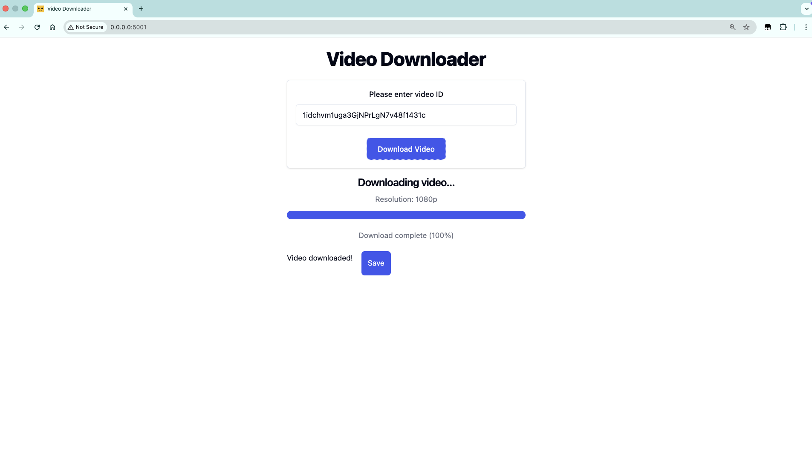

# 🎬 FastHTML Video Downloader

A lightweight full-stack web app for downloading HLS-streamed videos and subtitle files — built without a frontend framework.


---

## What it does

- **Video download** — takes a video ID, detects the best available resolution (1080p → 360p), and downloads the HLS stream as an `.mp4`
- **Live progress tracking** — the UI polls the server every second and updates a progress bar in real time, no page reloads
- **Subtitle export** — fetches and downloads English caption files (`.vtt`) for videos that have them
- **File serving** — streams the downloaded file directly back to the browser via a download prompt

---

## UI Example



---

## Tech stack

| Layer | Tool |
|---|---|
| Web framework | [FastHTML](https://fastht.ml/) + [MonsterUI](https://monsterui.answer.ai/) |
| Frontend interactivity | [HTMX](https://htmx.org/) |
| Async HTTP | `aiohttp` |
| Video processing | `ffmpeg` (via subprocess) |
| Server | Uvicorn (via `fasthtml.common.serve`) |

---

## Architecture

```
Browser
  │
  ├─ POST /start-download  →  spawns asyncio background task
  │                            └─ fetches video metadata
  │                            └─ calls ffmpeg to mux HLS → .mp4
  │
  └─ GET  /check-progress  →  polls every 1s via HTMX
                               └─ returns JS snippets to update DOM
                               └─ returns download link when done
```

The server never blocks on the download — `asyncio.create_task()` runs the ffmpeg job in the background while HTMX continuously polls a lightweight status endpoint.

---

## Running locally

**Prerequisites:** Python 3.10+, `ffmpeg` installed and on your PATH

```bash
# Clone the repo
git clone https://github.com/YOUR_USERNAME/hls-video-downloader
cd hls-video-downloader

# Install dependencies
pip install python-fasthtml monsterui aiohttp requests

# Set your API base URL
export VIDEO_API_BASE_URL="https://your-api-endpoint.com"

# Run
python download_videos.py
```

Open `http://localhost:8000` in your browser.

---

## Key implementation details

- **No JS framework** — all interactivity is driven by HTMX attributes in Python. The entire frontend is declared server-side using FastHTML's component model.
- **Async download pipeline** — `aiohttp` fetches video metadata; ffmpeg handles the actual HLS segment download and mux. The async task runs concurrently with incoming HTTP requests.
- **Temporary file management** — downloaded files are stored in the system temp directory and served on demand. A simple in-memory dict tracks file paths keyed by video ID.
- **Resolution detection** — parses the HLS master manifest to pick the highest available quality tier before handing the URL to ffmpeg.

---

## What I learned

- How HLS (HTTP Live Streaming) works — master manifests, resolution variants, and segment-based delivery
- How to integrate long-running subprocess jobs into an async web server without blocking
- Server-sent polling patterns with HTMX as an alternative to WebSockets for progress tracking
- FastHTML's approach to building full-stack Python apps without writing HTML or JS directly

---

## Possible improvements

- [ ] Replace polling with WebSockets or SSE for cleaner real-time updates
- [ ] Add download queue for multiple concurrent videos
- [ ] Auto-cleanup of temp files after a TTL
- [ ] Progress tracking from ffmpeg stderr output for accurate percentage

---

## License

MIT
